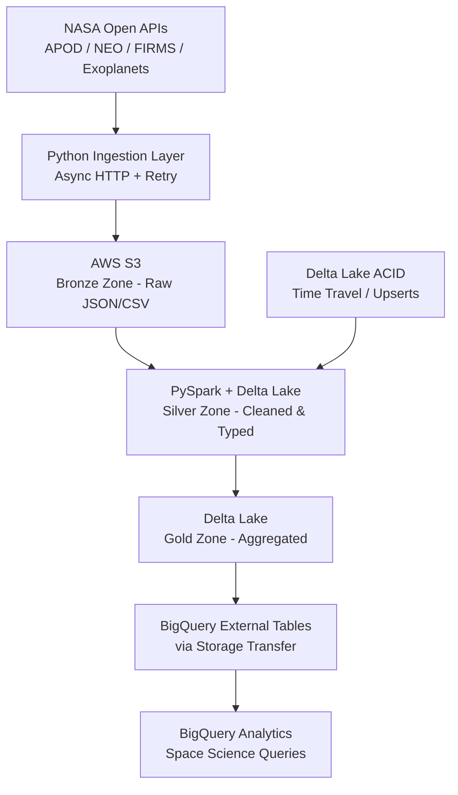

# NASA Data Pipeline — Delta Lake + S3 + BigQuery


Multi-cloud data pipeline that ingests publicly available NASA datasets (APOD, NEO asteroid tracking, FIRMS fire data, Exoplanet Archive) into a Delta Lake on S3, then replicates to Google BigQuery for cross-cloud analytics and scientific research queries.

## Architecture



## Features

- Async ingestion from multiple NASA public APIs
- Delta Lake medallion architecture (Bronze → Silver → Gold)
- ACID transactions and time-travel on S3 with Delta Lake
- Upsert (MERGE) operations for asteroid tracking updates
- Cross-cloud replication from AWS S3 to Google BigQuery
- Jupyter notebooks with scientific analysis examples

## Tech Stack

| Layer | Technology |
|-------|-----------|
| Data Sources | NASA Open APIs (8 datasets) |
| Raw Store | AWS S3 (Bronze) |
| Processing | PySpark + Delta Lake |
| Analytics | Google BigQuery |
| Notebooks | Jupyter + Pandas |
| Infrastructure | Docker Compose |

## Prerequisites

- Docker & Docker Compose
- AWS credentials (S3 access)
- Google Cloud credentials (BigQuery)
- NASA API Key (free at api.nasa.gov)

## Quick Start

```bash
git clone https://github.com/zulham-tech/nasa-delta-lake-s3-bigquery.git
cd nasa-delta-lake-s3-bigquery
cp .env.example .env  # add NASA_API_KEY, AWS keys, GCP credentials
docker compose up -d
python ingest/run_all.py --date today
```

## Project Structure

```
.
├── ingest/              # NASA API clients (async)
├── transforms/          # PySpark Delta Lake jobs
│   ├── bronze_to_silver/ # Cleaning & schema enforcement
│   └── silver_to_gold/   # Aggregations & enrichment
├── bigquery/            # BQ DDL & transfer configs
├── notebooks/           # Scientific analysis examples
├── docker-compose.yml
└── requirements.txt
```

## Author

**Ahmad Zulham** — [LinkedIn](https://linkedin.com/in/ahmad-zulham-665170279) | [GitHub](https://github.com/zulham-tech)
